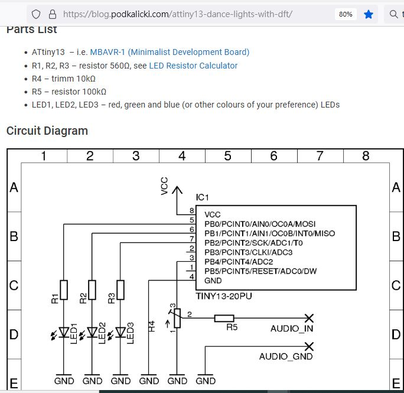

# tiny13 DFT, code for fun and learning,  
author : https://blog.podkalicki.com/attiny13-dance-lights-with-dft/  

### theory
reading, [theory](theory)  

### build testing  
uses build.bat  

### circuit diagram  
  

