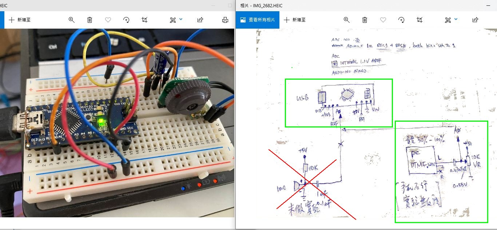
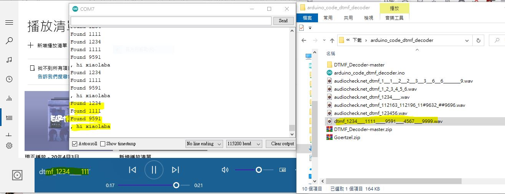

# ATmega8-DTMF-Decoder
another copy


# ATmega328-DTMF-Decoder  
copy http://qrp.valtellina.net/home/atmega328-DTMF-decoder, changed a bit for quick testing, no fork  
author's git https://github.com/qrpfun/DTMF_Decoder  


### no uses and did not have the LCD display, but required to install library of ug8lib in order to complie the code
the test circuit and scematic,
some info about,  
[sound input & RC filter](https://xiaolaba.wordpress.com/2020/06/21/attiny13-class-d-amp-%e9%96%8b%e9%97%9c%e5%bc%8f%e9%9f%b3%e9%9f%bf%e6%94%be%e5%a4%a7%e5%99%a8/)  
[DTMF decoding](https://xiaolaba.wordpress.com/2013/04/19/dtmf-%e9%9b%99%e9%9f%b3%e8%be%a8%e8%99%9f-%e8%a7%a3%e7%a2%bc-%e5%88%b0%e5%ba%95%e7%94%9a%e9%ba%bc%e6%98%af-%e9%a0%bb%e5%9f%9f-frequency-domain-%e5%92%8c-%e6%99%82%e5%9f%9f-time-domain/)  
  


### changed to uses 1.1V internal AREF, file ADC.ino

```
  // Select Vref=AVcc
  //ADMUX |= (1<<REFS0);
  //
  // 2021-07-01 xiaolaba test, done
  // Select Vref=1.1V internal VREF
  ADMUX |= (1<<REFS1) + (1<<REFS0);
  ```
  
  
  ### debug easy a bit, changed DTMF_decoder.ino  
  
  ```
    // initialize serial communication at 9600 bits per second:
  Serial.begin(115200);
  //Serial.begin(38400);

  Serial.begin(115200);
  Serial.print("\nXiaolaba test, DTMF decoder\n");
  Serial.print("\nUses internal 1.1V ADC reference\n");

  ```
  
  
  
  ```
      // 2021-07-01 xiaolaba test, done
    if ( !strcmp("9591", CodeSequence) ) // if equal
    {
       // DO WHATEVER YOU WANT
       bitClear(PORTB, 5);
       sprintf(Line, "Found %s\r\n", CodeSequence );
       Serial.print(Line);
       Serial.print(", hi xiaolaba\n");      
       strcpy(CodeSequence,"0000");
    }
  ```
  
### prepare the own DTMF wave file, to play by PC and sound card output
https://www.audiocheck.net/audiocheck_dtmf.php  
my example, [dtmf_1234____1111_____9591____4567____9999.wav](dtmf_1234____1111_____9591____4567____9999.wav)   
  
### how to test
1. connect arduino NANO, build the simple circuit  
2. turn 10K VR, uses DMM to visual around the trim 0.55v, (ADC VREF is 1.1V, bias ADC mid point of 0.55v = 1.1V / 2, then the singal could be used & span of full range for ADC0 or A0 of Arduino NANO)  
3. PC / earphone output, L or R connect to 0.47uF capacitor as single input  
4. play the wave file, [dtmf_1234____1111_____9591____4567____9999.wav](dtmf_1234____1111_____9591____4567____9999.wav)  
5. open ARduino IDE and termial, see the output  

### test done  
  
  
  
  
